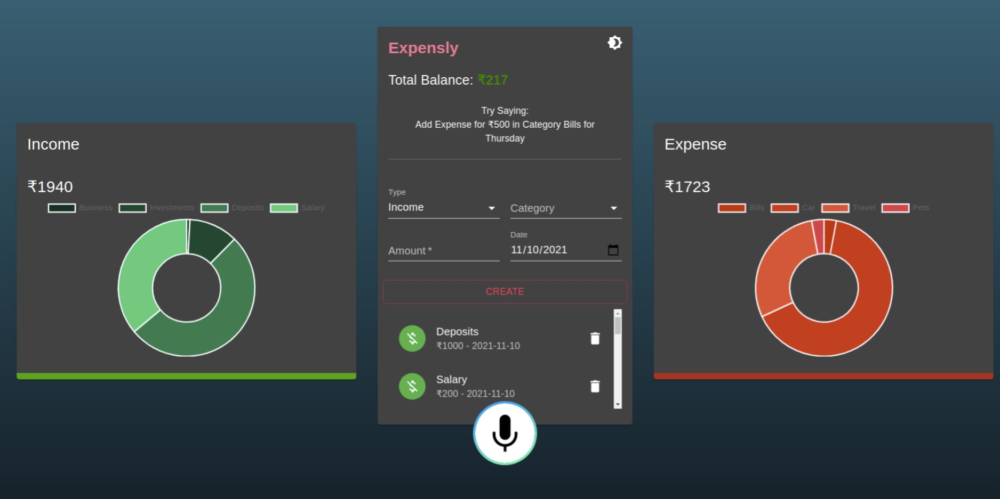

# [Expensly](https://xpensly.netlify.app/) 


&nbsp;
&nbsp;
&nbsp;
&nbsp;

[](https://xpensly.netlify.app/)

## Overview 👀



- Manage day to day transactions easily 💸
- Voice 🎙️ based transactions management 💰 
- Clean and Responsive UI with light ⚡ and dark mode
- Local Storage support for persistent of data🌐  

## What is Expensly? 

#### Expensly is a web app for journaling day to day transactions. Users can create or delete transactions details using voice.

## Project setup 💻

```
> Cloning the repo
    >> git clone https://github.com/harhskc/expensly.git
    >> cd Expensly
> Install all dependencies
    >> yarn install
> Start the app on localhost:3000
    >> yarn start
> Visit the website on http://localhost:3000/
    
```
