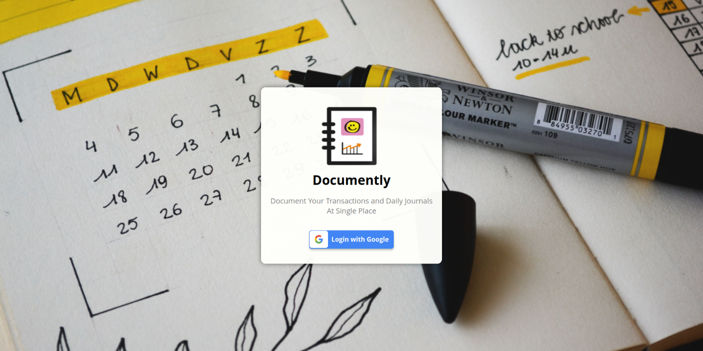

# [Documently](https://xpensly.netlify.app/)


[](https://xpensly.netlify.app/)


## Overview  




- Manage day-to-day transactions easily
- Manage daily Journaling easily
- Voice 🎙️ based transactions management
- Clean and Responsive UI with light and dark mode
- Persistence of data across multiple devices
- Installable PWA with offline capabilities

## What is Documently?

Documently is a progressive web app that helps you document your day-to-day transactions and daily Journals at single place.

## Project setup 💻

```
> Cloning the repo
    >> git clone https://github.com/harhskc/Documently.git
    >> cd Documently
> Install all dependencies
    >> yarn install
> Setup .env
    >> Copy .env.example then fill in your keys
> Start the app on localhost:3000
    >> yarn start
> Visit the website on http://localhost:3000/

```
